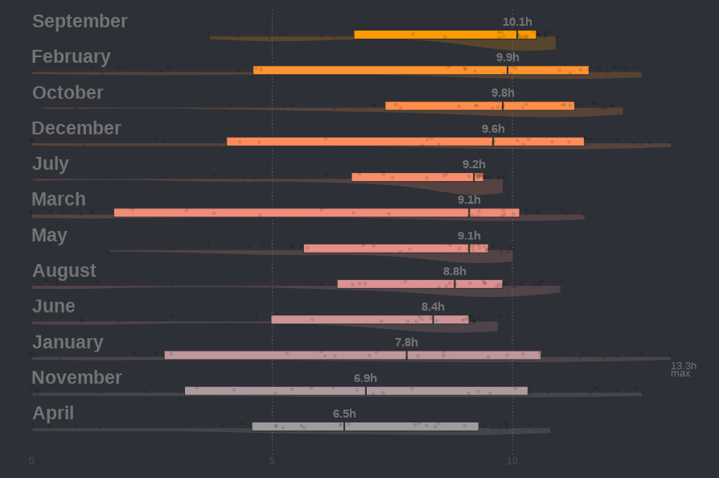

# Rain Forecast Dashboard

The Rain Forecast Dashboard is a R / Shiny web application that is part of the Rain Forecast Project.\
It features data visualizations built from weather observation data that are collected in real time as well as rain predictions using a machine learning model (AI).

The project also contains an API to support this dashboard with all the data engineering processes in the background.

## Project Summary

## Example of data visualization

